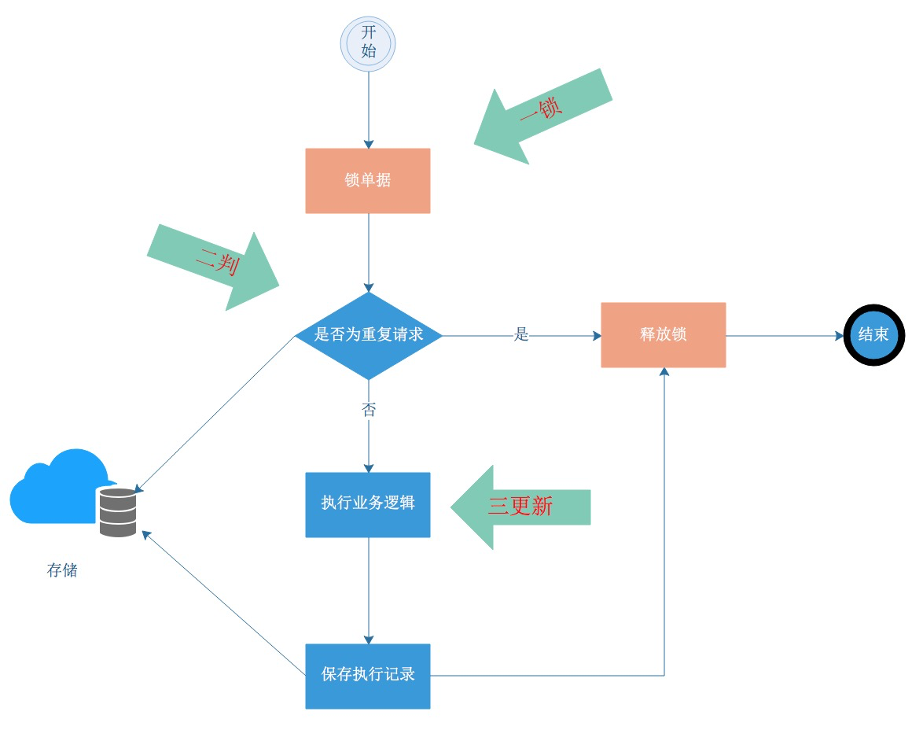

- [唯一索引](#唯一索引)  
- [token机制](#token机制)  
- [使用锁](#使用锁)  
- [顺序状态机约束](#顺序状态机约束)  
- [支持幂等调用](#支持幂等调用)  

## 正文

### 什么是幂等
幂等指的是相同请求（identical request）执行一次或者多次所带来的副作用（side-effects）是一样的。

### 唯一索引
唯一索引或唯一组合索引来防止新增数据存在脏数据 
```java
try {
    dao.insert(entity);    
    // do business
} catch (DuplicateKeyException e) {
    dao.select(param);
    // 幂等返回
}
```

### token机制  
采用token机制来实现防重复提交:  

  
  
### 使用锁
对于高并发的重复请求，要想办法改为串行的重复执行。常见的解决方案：一锁二判三更新。一锁，锁住要操作的资源；二判，识别是否为重复请求（第一部曲要定义的问题）、判断业务状态是否正常；三更新：执行业务逻辑  



### 顺序状态机约束  
在处理前先判断状态是否符合预期，如果符合预期再执行业务。当业务执行完成后，变更状态时还会采取类似于于乐观锁的方式兜底校验，例如，M状态只能从N状态转换而来，那么更新单据时，会在sql中做状态校验。

```SQL
    update apply set status = 'M' where status = 'N'
```

### 支持幂等调用

通过上游系统传递的reqNo+source来识别是否是为重复的请求，是重复请求则不做任何处理。通常处理方式是在数据库中添加这两个字段，每次请求时候，先查看数据库是否有这提数据。

